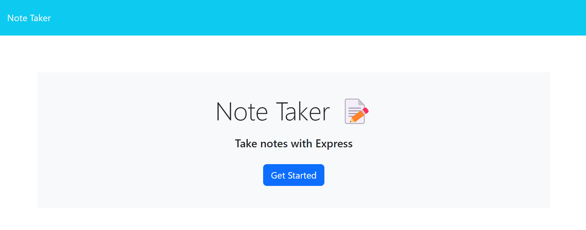
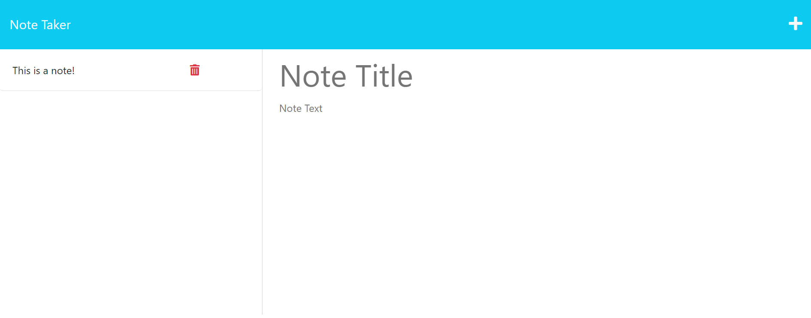

# AreYouTakingNotes


## Description

This is a simple note-taking application that allows you to create, view, and edit notes. The application is divided into two main pages: a landing page and a notes page.

**Landing Page**

The landing page contains a link to the notes page. When you open the note-taking application, you will be presented with the landing page.

**Notes Page**

The notes page contains a list of all of your existing notes in the left-hand column and empty fields to enter a new note title and the note's text in the right-hand column.

**Saving Notes**

When you enter a new note title and the note's text, a Save icon will appear in the navigation at the top of the page. To save your note, click on the Save icon.

**Viewing Notes**

To view an existing note, click on the note in the list in the left-hand column. The note will appear in the right-hand column.

**Creating New Notes**

To create a new note, click on the Write icon in the navigation at the top of the page. Empty fields to enter a new note title and the note's text will appear in the right-hand column.


## Installation

To use this application, simply open the following link in your browser:

```
https://quiet-anchorage-67384-6bb46d78cdc6.herokuapp.com/
```


## Features

- Create, view, and edit notes
- Save notes
- Delete notes


## Usage

1. Open the note-taking application.
2. Click on the link to the notes page.
3. To create a new note, click on the Write icon in the navigation at the top of the page.
4. Enter a note title and the note's text.
5. Click on the Save icon to save the note.
6. To view an existing note, click on the note in the list in the left-hand column.
7. To edit an existing note, click on the note in the list in the left-hand column and make your changes.
8. Click on the Save icon to save the changes.


## Credits

Previous activities and projects were referenced in creating this application.
My tutor, fellow students, and the TAs were consulted for assistance with this project.


## Screenshots





## Links

The URL of the deployed application is:

```
https://quiet-anchorage-67384-6bb46d78cdc6.herokuapp.com/
```

The URL of the GitHub repository is:

```
https://github.com/Flagg217/AreYouTakingNotes.git
```
